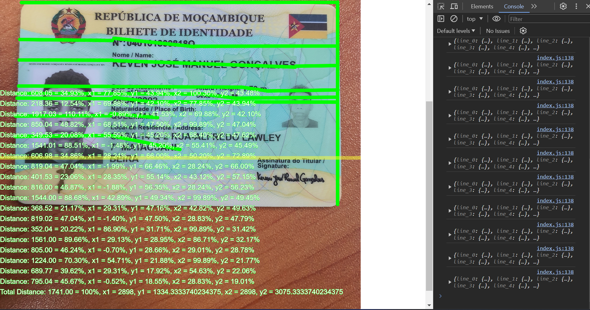
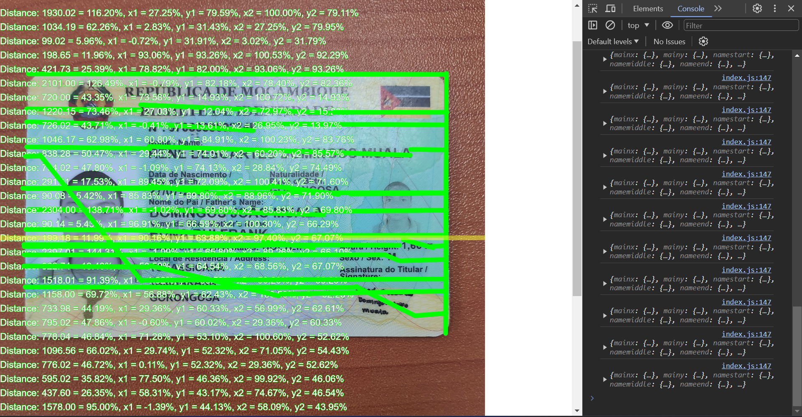

## GRASSHOPPER

This project calculates the percentage of coordinates inside a specific object.

## Table of Contents

- [Installation](#installation)
- [Usage](#usage)
- [Notes](#Notes)
- [Demos](#Demos)

## Installation

To install and set up the project, follow these instructions:

1. Clone the repository.
2. Open the project in your preferred code editor.

## Usage

To use the project, follow these steps:

0. Open the code in your favourite code editor
    - Replace the imageURL variable value to the path of the image that you want to analise.
1. Open the project in a web browser.
2. Zoom out the browser to the minimum level.
3. Press 'F2' to activate or deactivate ruller
4. Press 'Delete' to clear the drawings
5. Press 'Enter' when the ruler is placed in a good position
6. Click the starting x,y position and the ending x,y position in order to have a line drawn at this positions and at the bottom of the canvas there will be the results.
7. Click 'Backspace' to save the json result as a file in your computer
8. Click 'Shift' to switch the ruller direction (horizontal, vertical)
10. Note: Never forget to give labels to your mappings, for example you are mapping the positions of the name attribute in a document, first, place the ruller, second, write the labelName "(Only Aa-Zz) chars, no capsLocks, alt, or whatever other key", then you can proceed with the mapping.

## Notes
1. The first measurement that you take will be considered as the main and will be used as the reference for the upcoming measurement.
2. If you want to reset the main reference, just press 'Delete'

## Demos

Here are some demos of the project in action:

